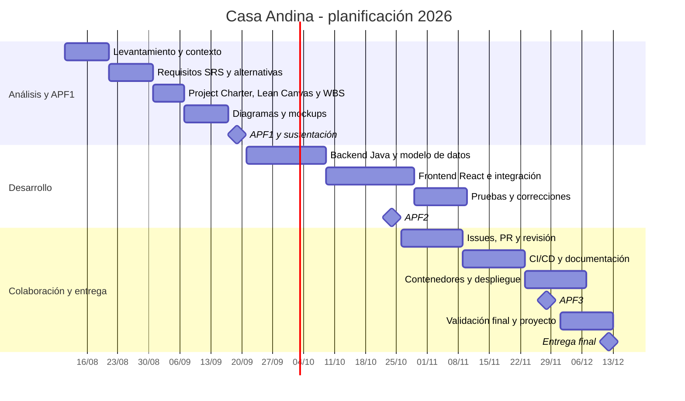

# Plan APF1 y trazabilidad del sílabo

**Proyecto:** Casa Andina - Sistema de Reservas Hoteleras  
**Periodo de trabajo:** 11/08/2026 al 12/12/2026  
**Backend:** Java 21 + Spring Boot  
**Frontend:** React + Vite  
**Base de datos:** MySQL/MariaDB

## Cronograma base para el Gantt



## WBS resumida

```text
1. Proyecto Casa Andina
   1.1 Análisis
       1.1.1 Contexto, problema e impacto
       1.1.2 Requisitos funcionales y no funcionales
       1.1.3 Lean Canvas y alternativas
   1.2 Planificación
       1.2.1 Project Charter
       1.2.2 Gantt
       1.2.3 WBS
   1.3 Diseño
       1.3.1 Casos de uso y proceso
       1.3.2 Clases y entidad-relación
       1.3.3 Mockups y arquitectura
   1.4 Implementación
       1.4.1 API Java/Spring Boot
       1.4.2 Frontend React
       1.4.3 Integración MySQL/MariaDB
   1.5 Calidad y entrega
       1.5.1 Issues y Pull Requests
       1.5.2 Integración continua
       1.5.3 Contenedores, despliegue y validación
```

## Trazabilidad con el sílabo

| Unidad | Evidencia en el repositorio |
|---|---|
| Control de versiones | Ramas, commits, Pull Requests y `README.md` |
| Herramientas complementarias | Issues, documentación, workflow de CI |
| Plataformas de soporte | Workflow de compilación; contenedores y despliegue quedan para APF3/proyecto final |

